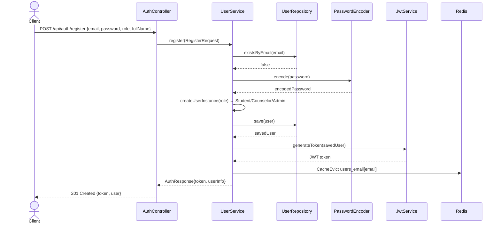
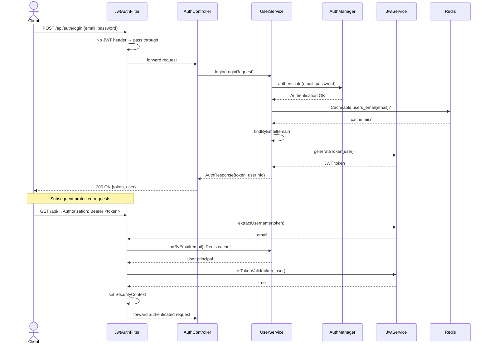
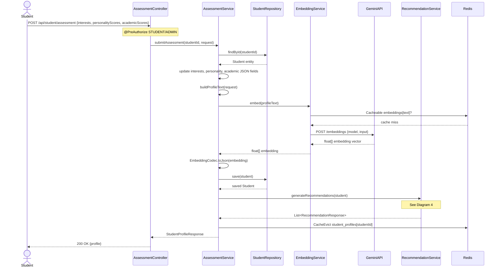
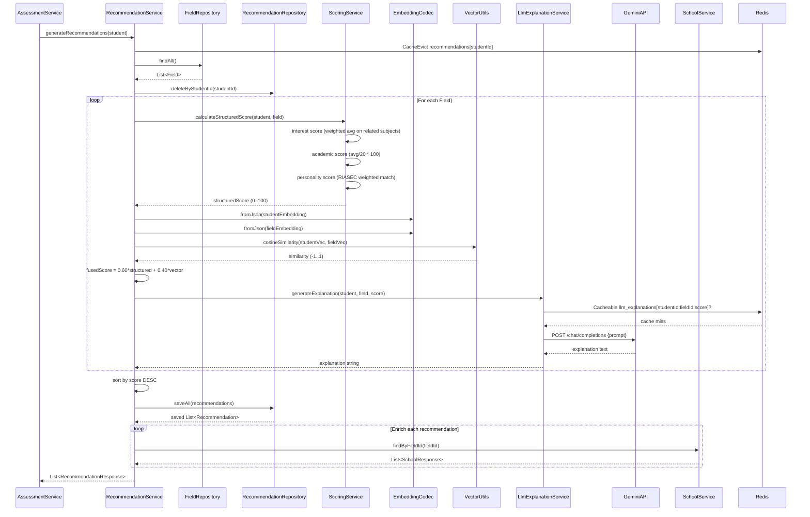
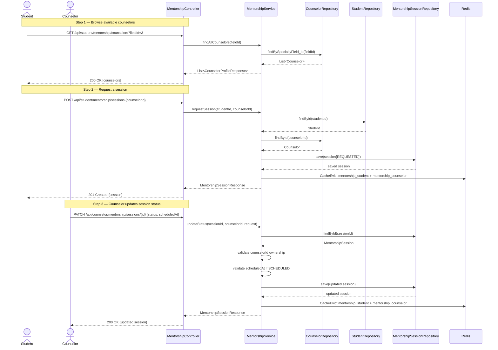
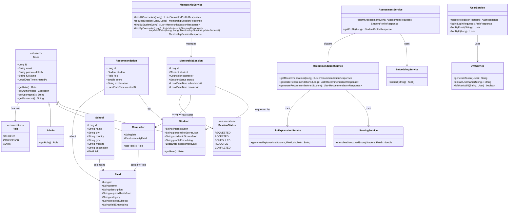
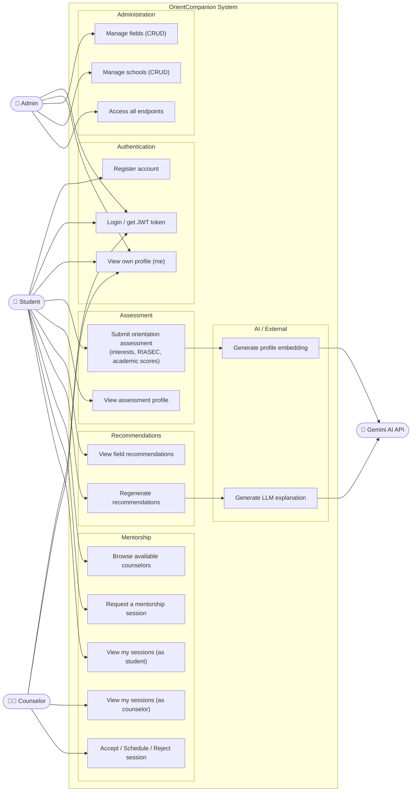

# OrientCompanion — UML Diagrams

> [!NOTE]
> This document covers: **Sequence Diagrams** (5 flows), a **Class Diagram** (domain model + services), and a **Use Case Diagram** (actors & system features).

---

## 1. User Registration

---

## 2. Login & JWT Authentication Filter

---

## 3. Assessment Submission

---

## 4. Recommendation Generation

---

## 5. Mentorship Session Lifecycle

---

## 6. Class Diagram — Domain Model & Service Layer

---

## 7. Use Case Diagram

